# Science en Hi-Tech dag 2017

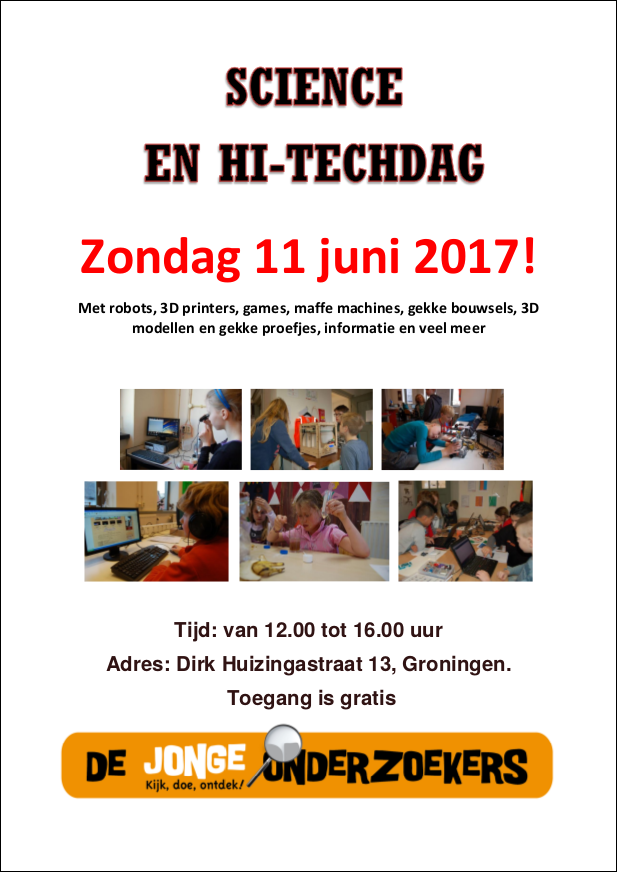

 * Waar: De Jonge Onderzoekers Groningen, Dirk Huizingastraat 13, Groningen
 * Wanneer: zondag 11 juni 2017 12:00-16:00
 * Entree: gratis

## Foto's

Het evenement is geweest. Onze leerlingen gaven weer les natuurlijk!

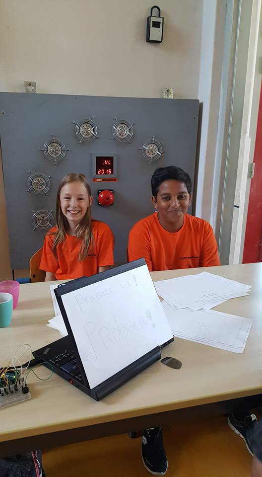
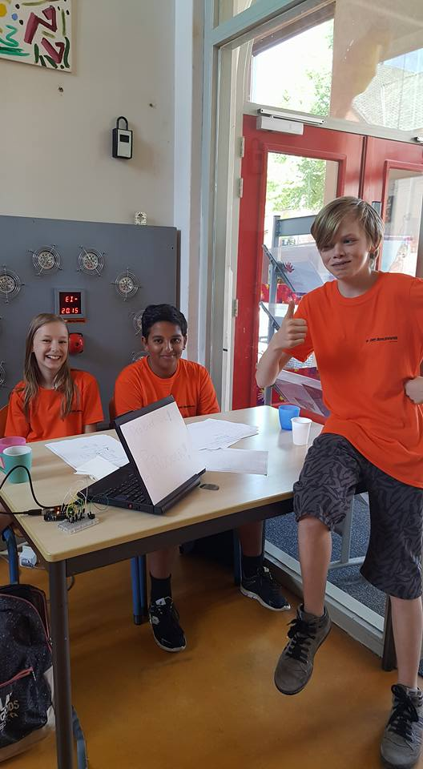

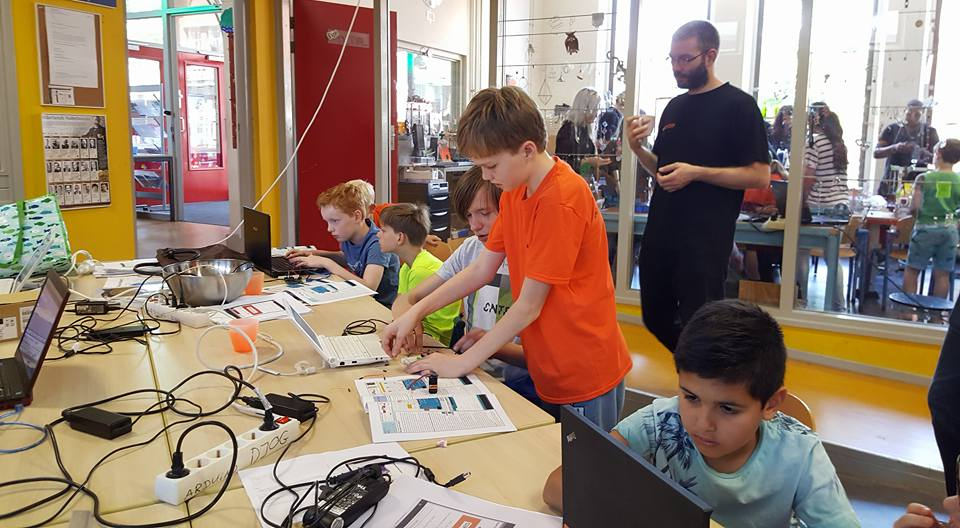
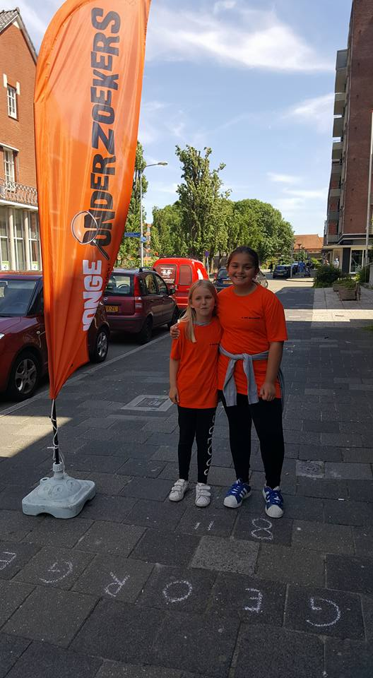
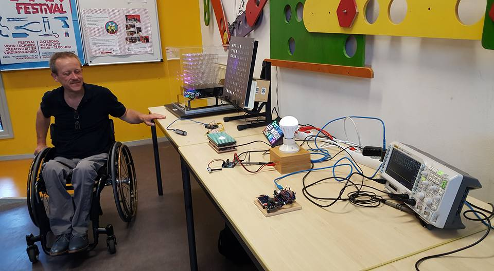
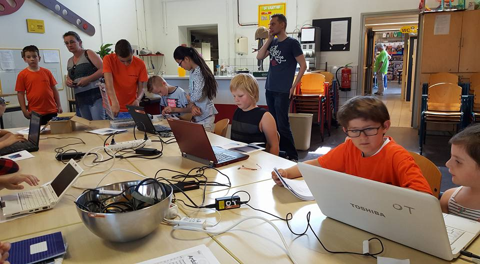

## Persbericht

 * [Gezinsbode](http://www.gezinsbode.nl/evenementen/71435/science-en-hi-techdag-bij-de-jonge-onderzoekers/)

Op zondag 11 juni organiseren we de Science & Hi-Techdag bij De Jonge Onderzoekers!

Er zijn genoeg makers die gave dingen maken. Op TV en YouTube zie je hun robots, 3D printers, games, machines, 3D modellen en proefjes. Zou jij dit ook willen? Zet dan je eerste stap op de Science en Hi-Tech dag! De Jonge (en ook volwassen) Onderzoekers leren je het allereerste begin. Alleen maar kijken is geen optie!

Verschillende afdelingen en cursussen presenteren zich op deze dag! Zo zullen er demonstraties zijn van Arduino, van het First Lego League team, van de Codestarter Codeclub, van de 3D club en de Natuur&Techniek Cursus. En nog veel meer. En het blijft niet bij presenteren. Je kunt bijna overal ook meedoen! 

De Science en Hi-Tech dag is op zondag 11 juni 2017 van 12:00-16:00 bij De Jonge Onderzoekers, Dirk Huizingastraat te Groningen. De entree is gratis.

Meer informatie over het programma volgt zsm via onze website www.djog.nl!

## Activiteiten

afdeling|activiteit
---|---
Metaal|Galvanizeren
3D printers|Print een raket
Arduino|Programmeer een machine
Dojo|Programmeer een game
Natuur & Techniek|Meerdere experimenten
FLL|Bouw een robot
FTC|Bedien een robot
FRC|Bedien een robot

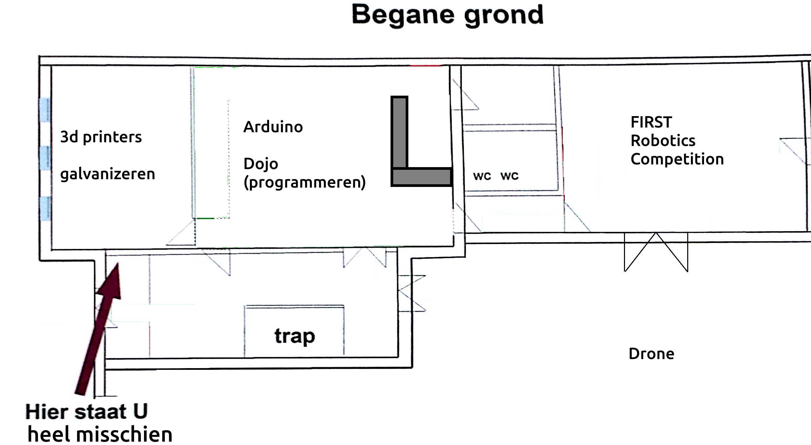

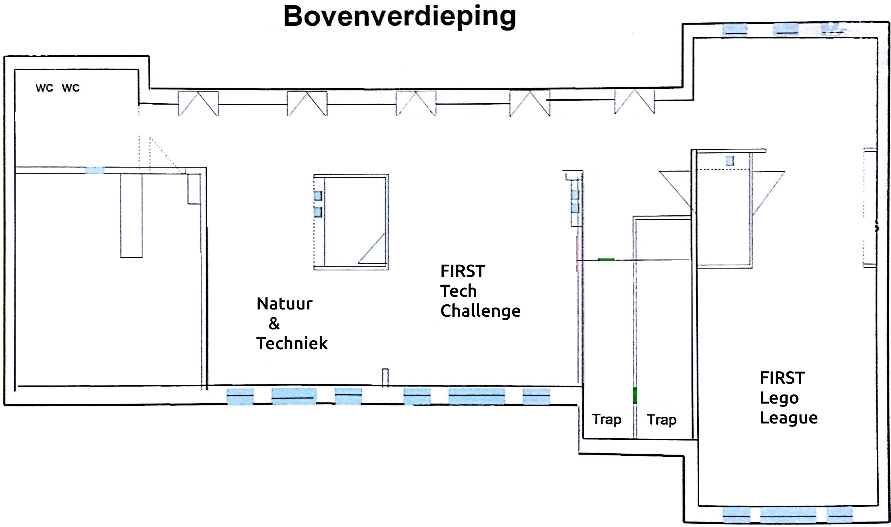

## Locaties

afdeling|locatie
---|---
Metaal|Fijnmetaal lokaal
3D printers|Fijnmetaal lokaal
Arduino|Kantine
Dojo|Kantine
Natuur & Techniek|Lab
FLL|Papier en textiel
FTC|Electronica-afdeling
FRC|Houtlokaal
Drone|Plein
Werkstukken|Kantine

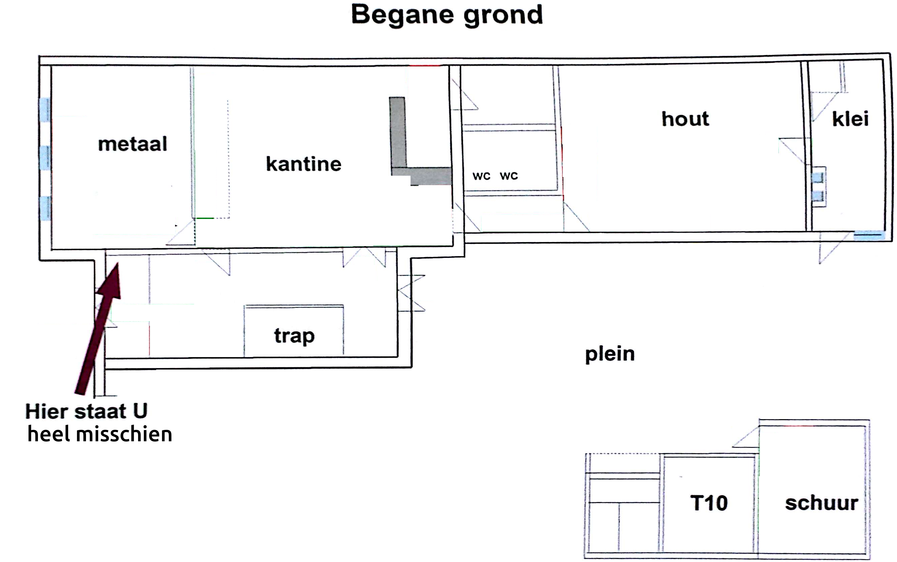

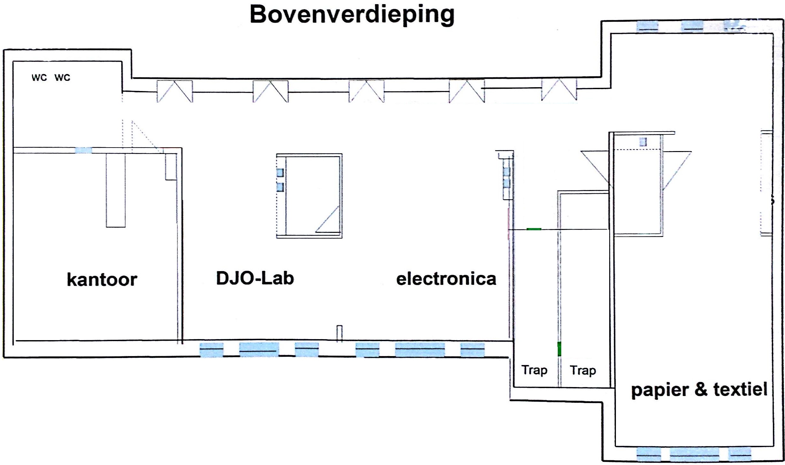

## Entree

Bij de entree komt een receptie, bemand door Amaia en Carleen.

## Bar

Bar blijft onbemand.
Ranja staat klaar en is gratis
Koffie en thee is 50 cent en kan met een pot betaald worden.

## Foto's

Carleen maakt foto's

## Contactpersonen

afdeling|contactpersoon
---|---
Metaal|Martijn
3D printers|Arlette, Erik, Jan de J.
Arduino|Jan K.
Dojo|Frode en Dagmar
Natuur & Techniek|Peter
FLL|Harry
FTC|Gert-Jan
FRC|Henk
Drone|Klaas

