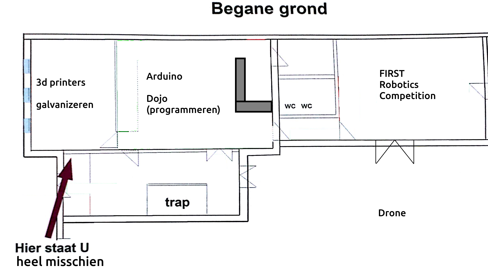
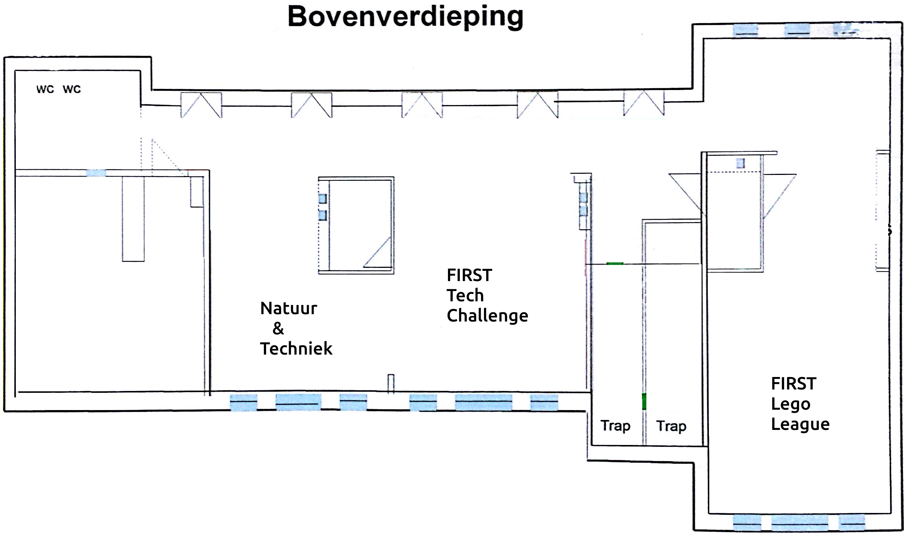

# Informatie voor de receptie

## Activiteiten

afdeling|activiteit
---|---
Metaal|Galvanizeren
3D printers|Print een raket
Arduino|Programmeer een machine
Dojo|Programmeer een game
Natuur & Techniek|Meerdere experimenten
FLL|Bouw een robot
FTC|Bedienen een robot
FRC|Bedienen een robot

## Locaties

afdeling|locatie
---|---
Metaal|Fijnmetaal lokaal
3D printers|Fijnmetaal lokaal
Arduino|Kantine
Dojo|Kantine
Natuur & Techniek|Lab
FLL|Papier en textiel
FTC|Electronica-afdeling
FRC|Houtlokaal
Drone|Plein
Werkstukken|Kantine

## Bar

Bar blijft onbemand.
Ranja staat klaar en is gratis
Koffie en thee is 50 cent en kan met een pot betaald worden.

## Foto's

Carleen maakt foto's

## Contactpersonen

afdeling|contactpersoon
---|---
Metaal|Martijn
3D printers|Arlette, Erik, Jan de J.
Arduino|Jan K.
Dojo|Frode en Dagmar
Natuur & Techniek|Peter
FLL|Harry
FTC|Gert-Jan
FRC|Henk
Drone|Klaas
